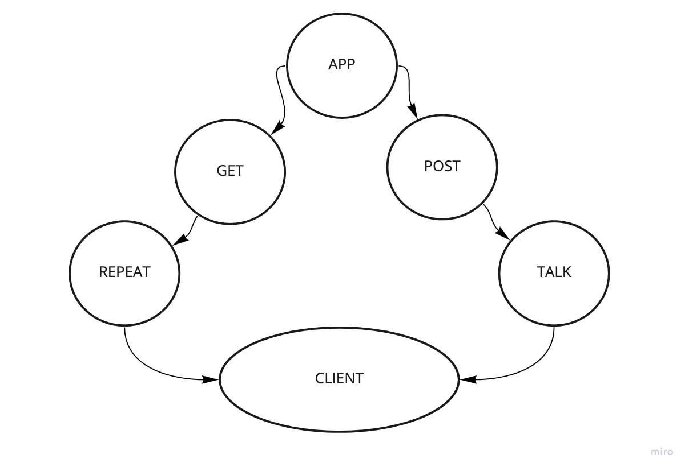

# Server Deployment Practice

***

### Created by Cameron Walden

***

## Problem Domain

Creating and deploying a web server using CI and CD for practice that will get us used to the general process of building and deploying servers.

***

## Links to Application Deployment

https://cameron-server-deploy-dev.herokuapp.com/repeat

https://cameron-server-deploy-prod.herokuapp.com/repeat

***

## Embedded UML

***

## Routes

 - **HTTP GET**
  - Path: /repeat
   

- **HTTP POST**
 - Path: /talk
   - accepts a string
